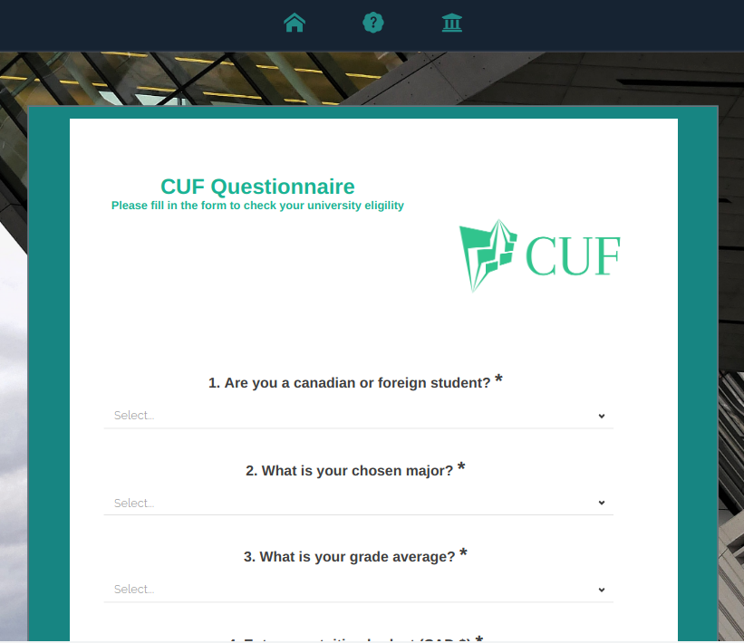
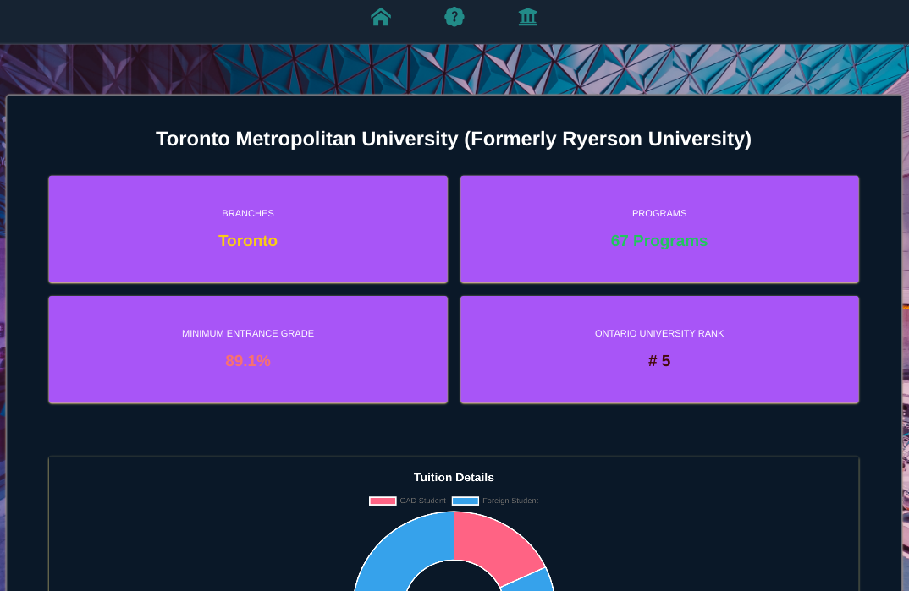
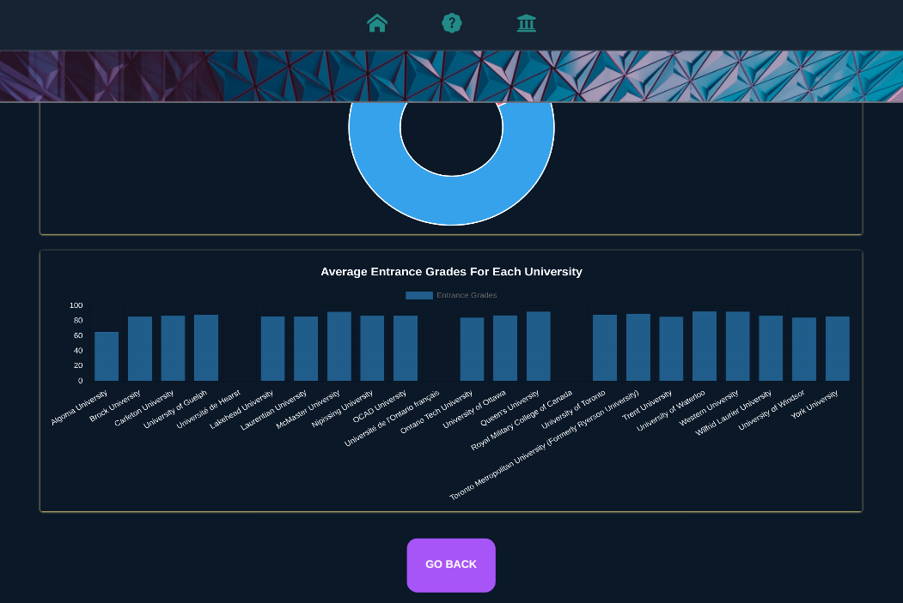

# CUF 

An ontario university filter/eligibility parser for Canadian students.

- Gets information on your top university
- Lets the mathing algorithm pick your best match
- Look for information on all available universities


## App Features


### Questionnaire


```
  Gather information from end-user to dynamically render dashboards 
  (major constraints: university, tuition, canadian status)
```

### Loading screen


```
  Loader between API calls
```

### Dashboards



```
  Dynamic dashboards which populates cards, doughnut & bar charts based 
  on selected options: best match (algorithm) or selected university
```


## Main programs used

Client
```
TailwindCss, React,Javascript

``` 

Server
```
Cheerio, Node, Express, Axios

``` 

## Packages, Libraries, Techonolgies & APIs Used

React UseContext
```
    Refactored code to reduce number of API calls, lines of code & speed of data
    load to enhance end-user experience. 
```

Chart.js
```
    Used to create doughnut & bar charts
```
Axios
```
    Process http requests
```
Cheerio
```
 A fast headless browser (does not render actual UI )  that is DOM parser without executing Javascript on the webpages, unlike Puppeteer.
```
React Load Spinner
```
    Handle loading screen on API wait
```
Survey.js
```
    Creates questionnaire & extract array to dynamically render data
```
Icons
```
    React Icons, icon8 & heroIcons
```

Routing
```
React router
```

APIs
```
My own REST API deployed on render (checkout CUF_server repo)
```


Notifications
```
React Toastify to handle notifications
```


## Challenges

Efficiency 
```
Refactored code to make use of lazy loading & react useContext to improve load speed of the full-stack application.
```

Web-Scraping & compiling the data before deploying the REST API
```
This is was first time creating my own json data from scratch since the data I needed was not available to the public. Finding reliable data & scrapable website required lots of patience since some parts were retricted or had outdated information.

I also learnt about headless browsers, web-scraping & its ethics.
```

String Manipulation
```
My data structures & algorithms practice with leetcode helped a lot with the string manipulation I had to do.
I learnt a lot of newer ways to use array & string methods with higher order functions. 
Really helped solidified my string manipulation skills.
```
## Run Locally

Clone the project.

Client
```
  npm run dev
```

Server
```
  nodemon index.js
```

# CUF_server
https://github.com/hakeem0114/CUF_server